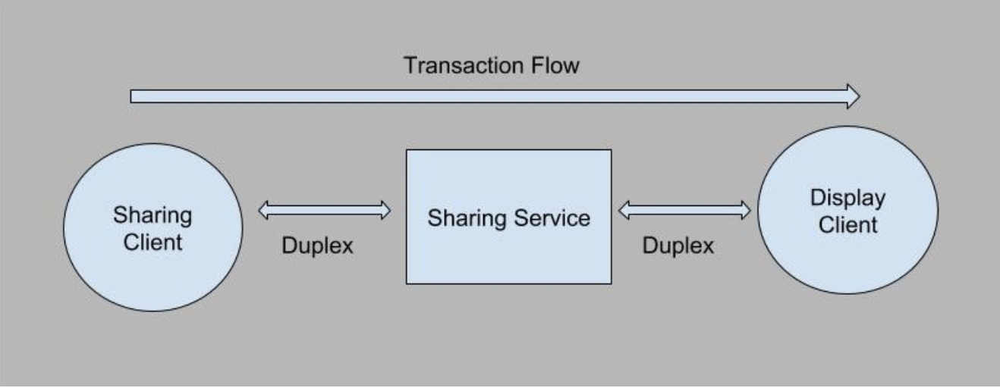

I came across a situation where I had to perform transactional work in a session enabled WCF service. Transaction was required to perform certain operations atomically, either completely successful or completely unsuccessful, such as consider a scenario where user logs in and creates a session with a WCF service and have to call two operations from two different services from the client side, the system should make sure that either both operations fail or both succeed, otherwise the state of the application can become inconsistent with the business logic. Fortunately, .NET allows us to achieve this by using Transaction Scopes. WCF also utilizes underlying Transaction Scope class to support transactions in services, that however requires some declarative configuration at the WCF end.

### My Scenario

I implemented a sharing service and two client applications, Sharing and Display client. Sharing client requests to share any media to the Sharing service, which then callbacks to the Display client to display that media. Sharing service is maintaining list of connected clients statically in a local concurrent dictionary.



Above mentioned scenario can be easily implemented without transactions by using duplex callbacks to update the status of request and notify it to the Sharing client. But I wanted to do it with transactions so that the complete sharing flow logic runs under one transaction, if anything goes wrong during request, either during sharing, performing database operations or during displaying, the share should fail.

### Configuring WCF

First of all, we need to select the right binding that supports transactions such as TCP ,WS and NamedPipe bindings. Then allow the flow of the client’s transaction in to the WCF operations by setting Transaction Flow property to true in the binding.

```xml
<bindings>
 <netTcpBinding>
  <binding name="shareTcpBinding" transactionFlow="true">
  </binding>
 </netTcpBinding>
</bindings>
```

Only setting the transaction flow in the binding is not enough, we need to tell WCF that on which operations we need to support the flow. We do this by specifying Transaction Flow attribute on the operation in service contract.

```csharp
[OperationContract]
[TransactionFlow(TransactionFlowOption.Allowed)]
void Share(string sessionId, string uri);
```

Note that you can also set Mandatory and NotAllowed in the Flow Option above.

Now that, transaction flow is set, we need to tell WCF operation to support the transaction. To do this we add Operation Behavior attribute above the operation implementation and set its Transaction Scope Required and Transaction Auto Complete properties.

```csharp
[OperationBehavior(TransactionScopeRequired = true, TransactionAutoComplete = true)]
public void Share(string sessionId, string uri)
{
    //implementation
}
```

In order to not corrupt the state within the session, by default WCF treats the per session service as per call service, by setting the ReleaseServiceInstanceOnTransactionComplete in the service behavior attribute to true (default value). This however, does not allow to set Concurrency mode of service other than Single, which makes sense as if there are multiple clients accessing the service instance, disposing the instance will cause serious errors.

If any operation is found in the service that requires transaction scope, and if ReleaseServiceInstanceOnTransactionComplete is true then WCF makes sure that you set the single concurrency mode. To overcome this, we can set ReleaseServiceInstanceOnTransactionComplete to false and set our concurrency mode to Multiple. In this case, however, we will have to take care of the in-session state of service, which can become inconsistent if transaction is rolled back.

So, the final configuration of my service behavior is

```csharp
[ServiceBehavior(InstanceContextMode = InstanceContextMode.PerSession, ConcurrencyMode = ConcurrencyMode.Multiple, ReleaseServiceInstanceOnTransactionComplete = false)]
public class ShareService : IShareService
{
    //implementation
}
```

By setting this, the client will be able to flow his transaction to the service and perform his operation under that transaction. To flow the same transaction to Display client, we have to enable the transaction flow in the callback and its implementation

```csharp
 public interface IShareServiceCallback
 {
  [OperationContract]
  [TransactionFlow(TransactionFlowOption.Mandatory)]
  void ShareUpdate(string uri);
 }

 [CallbackBehavior(ConcurrencyMode = ConcurrencyMode.Multiple)]
 public class ShareServiceCallback : IShareServiceCallback
 {
  [OperationBehavior(TransactionScopeRequired = true)]
  public void ShareUpdate(string uri)
  {
    //fire event for the client
    UpdateShare(this, uri);
  }
 }
```

Note that I’ve set configured the transaction flow as mandatory in the callback so that it could take service provided transaction and perform its operation within that transaction only. Now, our transaction will originate from Sharing client and will be flowed to Share service, share service then send transactional callback to the Display client, which will display the shared media. If anywhere between this process, any error occurs, our transaction will rolled back and an exception will be thrown, which can be cached by service and Sharing client both in order to perform required actions there.
