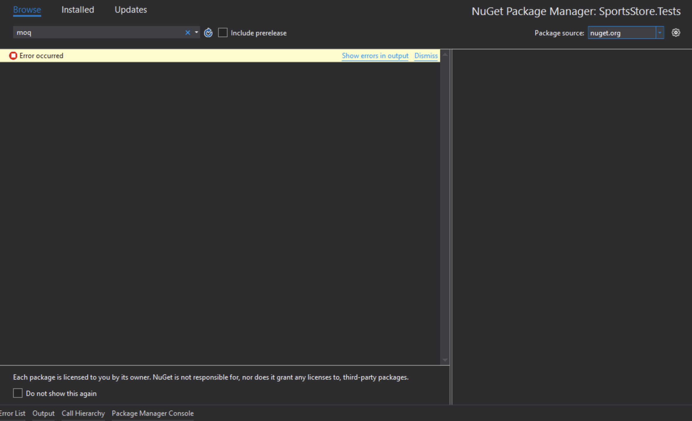
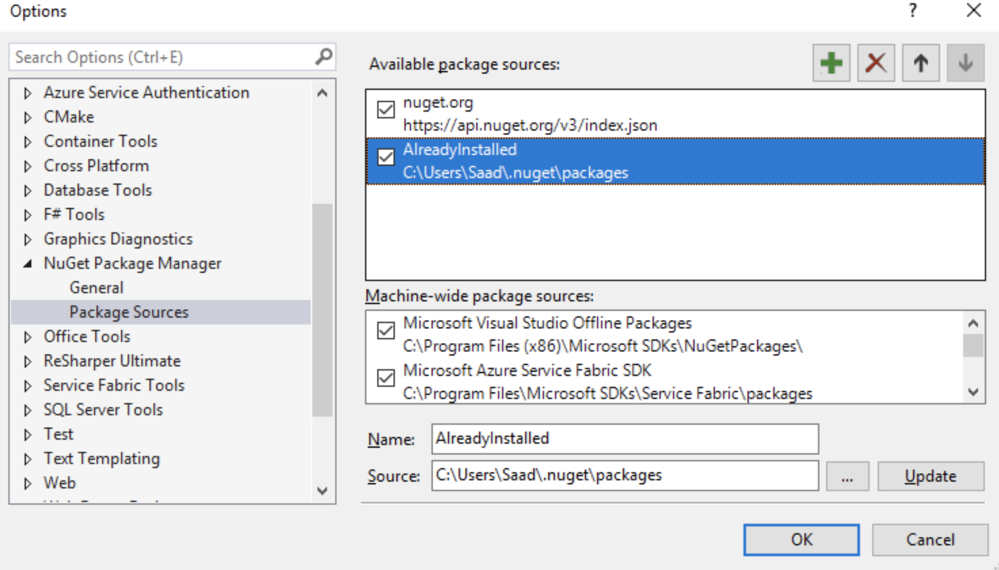

I was on a short trip and had no access to Wi-Fi or data connection. I was working on a project in Visual Studio that was not built before on my laptop, so its NuGet packages were not restored. Following screen appeared when I was offline and unable to install NuGet packages



I started to explore my hard drive to find any previous downloaded packages and fortunately NuGet had cached all packages in to following location

```cmd
C:\Users\Saad\.nuget\packages
```

On top right of the above image, there is an option to select the source from where NuGet Package Manager fetches all packages. And next to it is a setting button that opens the following window.



From here you can simply add a new package source by pointing it to the right path. This path can be different based on the configuration and settings on your machine. Once, I added and selected this source, all installed packages were displayed and I was able to install them as if I’m getting them from [nuget.org](https://www.nuget.org). So in case you are offline and happen to have installed required NuGet package previously, there are chances that the package is cached on your drive. Just find the package folder, add new source like above and you are good to go.
