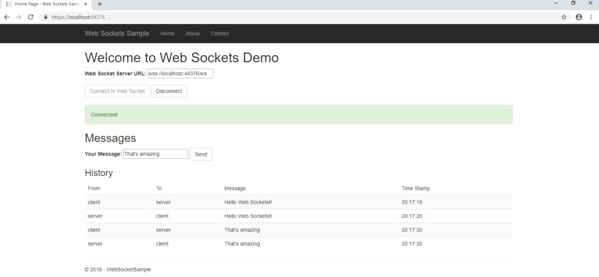

Setting up Web Sockets in a web app is pretty simple and straightforward. Almost all the standard browsers provide support for web socket protocol and almost all web servers understand that protocol pretty well.

My setup includes ASP.NET Core with IIS Express and vanilla JavaScript on the front end to send and receive messages.

First you have to go to Windows Features and turn on Web Sockets support under IIS settings. That will let IIS to speak WS protocol.

Secondly, for this demo, I scaffolded an ASP.NET Core MVC app. It will auto install Microsoft.AspNetCore.WebSockets dll under the meta package of Microsoft.AspNetCore.App. Next, I created an Echoing middleware, that accepts the WS client requests and updates the protocol to WS. It also, wait for client’s messages and sends back the same response, until connection is closed. The code for middleware is shown below:

```csharp
public class WebSocketEchoMiddleware
{
    public WebSocketEchoMiddleware(RequestDelegate next)
    {

    }

    public async Task InvokeAsync(HttpContext context)
    {
        if (context.WebSockets.IsWebSocketRequest)
        {
            WebSocket webSocket = await context.WebSockets.AcceptWebSocketAsync();

            var buffer = new byte[1024 * 4];

            WebSocketReceiveResult result = await webSocket.ReceiveAsync(new ArraySegment(buffer), CancellationToken.None);

            while (!result.CloseStatus.HasValue)
            {
                await webSocket.SendAsync(new ArraySegment(buffer, 0, result.Count), result.MessageType, result.EndOfMessage, CancellationToken.None);

                result = await webSocket.ReceiveAsync(new ArraySegment(buffer), CancellationToken.None);
            }
            await webSocket.CloseAsync(result.CloseStatus.Value, result.CloseStatusDescription, CancellationToken.None);
        }
        else
        {
            context.Response.StatusCode = StatusCodes.Status400BadRequest;
        }
    }
}
```

To wire up this middleware in the request pipeline, I wrote and extension and wired it up in the Startup.cs class.

```csharp
public static class WebSocketEchoMiddlewareExtension
{
    public static IApplicationBuilder UseWebSocketEcho(this IApplicationBuilder app, string pathMatch, WebSocketOptions options)
    {
        if (app == null)
        {
            throw new ArgumentNullException(nameof(app));
        }

        app.UseWebSockets(options);

        return app.Map(pathMatch, builder => builder.UseMiddleware());
    }
}
```

```csharp
app.UseWebSocketEcho("/ws", new WebSocketOptions { KeepAliveInterval = TimeSpan.FromSeconds(120), ReceiveBufferSize = 4 * 1024 })
    .UseMvc(routes =>
    {
        routes.MapRoute(
            name: "default",
            template: "{controller=Home}/{action=Index}/{id?}");
    });
```

As we can see, we are mapping any calls that request to `/ws` and route it to the middleware. It let us serve other requests as usual but only that request web socket operations and entertained by the middleware.

The `Index.html` code produces the following side end result.



We connect to the server using Web Socket server URL using JavaScript and send plain text messages to the server over web socket. Below is the code snippet of javaScript that does that.

```csharp
socket = new WebSocket(wsEndpoint.value.trim());

socket.onopen = function () {
  UpdateControls(true);
};

socket.onclose = function () {
  UpdateControls(false);
};

socket.onmessage = function (evt) {
  updateTable(evt.data, false);
};
```

And following is the Send button handler code

```csharp
document.getElementById("send").addEventListener("click", function () {
  var msg = document.getElementById("message").value;

  if (!msg || msg == "") {
    alert('Please enter your message');
    return;
  }

  if (!socket || socket.readyState != WebSocket.OPEN) {
    alert('Socker not connected');
    return;
  }

  socket.send(msg);
  updateTable(msg, true);
});
```

That’s pretty much it from the client side. Of course it can be tweaked and some error handling, re-connection and retrying logic can be added for production level code. But for demo purpose, it works fine.

You can find the complete source code on my [Github](https://github.com/saadsaifse/web-sockets-sample) account. Cheers!
