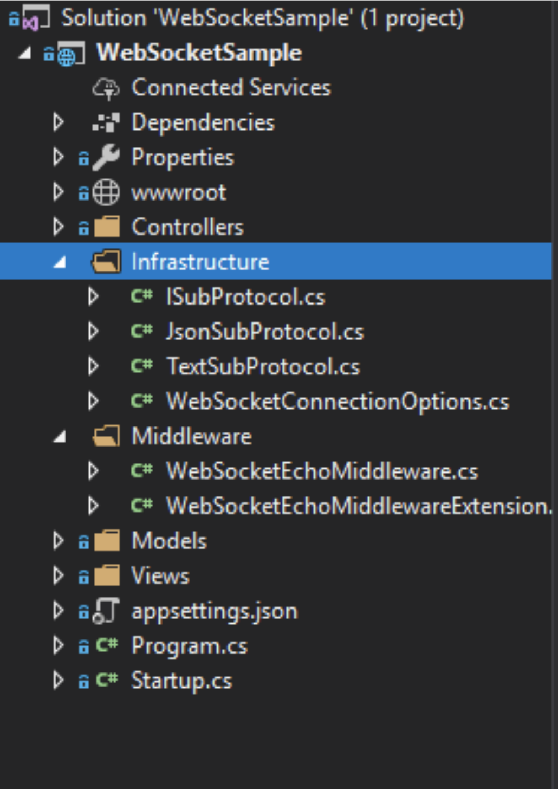
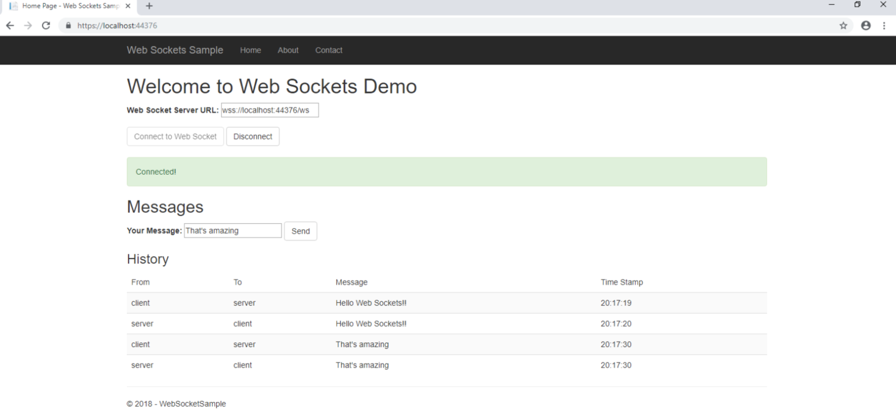

Web Sockets introduces an interface that allows to send and receive data either in the form of plain text or a blob, which is just a raw byte data. But what if we want to send an object along with some properties, or some metadata? something like `{msg: “this is message”, timestamp: “14:48 03-10-2018”}`. For that web sockets provide the option of sub protocols, which are nothing but a way to tell client and server to expect data in a certain format.
Today I’ll implement a simple JSON web socket sub protocol, named, `ws.json` to provide timestamp along with the server’s response. I’ll build upon my original demo application which I’ve blogged [here](../web-sockets-basic-setup).

First, I’ve written an abstraction of sub protocol as an interface `ISubProtocol`

```csharp
public interface ISubProtocol
{
  string Name { get; }
  Task SendAsync(string message, WebSocket socket, CancellationToken cancellationToken);
  string Receive(string message);
}
```



And provided two implementations `TextSubProtocol` and `JsonSubProtocol`. I’ve added them in Infrastructure folder, that looks like below:

```csharp
public class JsonSubProtocol : ISubProtocol
{
  public string Name => "ws.json";

  public string Receive(string message)
  {
    return message;
  }

  public async Task SendAsync(string message, WebSocket socket, CancellationToken cancellationToken)
  {
    var msg = JsonConvert.SerializeObject(new { message, timestamp = DateTime.UtcNow });

    if (socket.State == WebSocketState.Open)
    {
        await socket.SendAsync(new ArraySegment(Encoding.UTF8.GetBytes(msg), 0, msg.Length), WebSocketMessageType.Text, true, cancellationToken);
    }
  }
}
```

I’ve also created a WebSocketConnectionOptions class that let us define supported protocols, default protocol, buffer sizes and connection keep alive time.

```csharp
public class WebSocketConnectionOptions
{
  public ISubProtocol DefaultProtocol { get; set;  }
  public IList SupportedProtocols { get; set; }
  public int ReceiveBufferSize { get; set; }
  public TimeSpan KeepAliveInterval { get; set; }

  public WebSocketConnectionOptions()
  {
    ReceiveBufferSize = 4 * 1024;
    KeepAliveInterval = TimeSpan.FromSeconds(120);
  }
}
```

Next, I updated the middleware that accepts the web socket request as per the initiated protocol and call send method on the respective protocol class. Middleware’s code looks like this now.

```csharp
public class WebSocketEchoMiddleware
{
  readonly WebSocketConnectionOptions options;
  public WebSocketEchoMiddleware(RequestDelegate next, WebSocketConnectionOptions options)
  {
      this.options = options;
  }

  public async Task InvokeAsync(HttpContext context)
  {
    if (context.WebSockets.IsWebSocketRequest)
    {
      ISubProtocol subProtocol = DetectSubProtocol(context);

      WebSocket webSocket = await context.WebSockets.AcceptWebSocketAsync(subProtocol?.Name);

      var buffer = new byte[options.ReceiveBufferSize];

      WebSocketReceiveResult result = await webSocket.ReceiveAsync(new ArraySegment(buffer), CancellationToken.None);

      subProtocol = subProtocol ?? options.DefaultProtocol;
      while (!result.CloseStatus.HasValue)
      {
          if (result.MessageType == WebSocketMessageType.Text)
          {
              var message = Encoding.UTF8.GetString(buffer, 0, result.Count);
              await subProtocol.SendAsync(message, webSocket, CancellationToken.None);

          }
          result = await webSocket.ReceiveAsync(new ArraySegment(buffer), CancellationToken.None);
      }
      await webSocket.CloseAsync(result.CloseStatus.Value, result.CloseStatusDescription, CancellationToken.None);
    }
    else
    {
      context.Response.StatusCode = StatusCodes.Status400BadRequest;
    }
  }

  ISubProtocol DetectSubProtocol(HttpContext context)
  {
    ISubProtocol subProtocol = null;

    foreach (var supportedProtocol in options.SupportedProtocols)
    {
      if (context.WebSockets.WebSocketRequestedProtocols.Contains(supportedProtocol.Name))
      {
          subProtocol = supportedProtocol;
          break;
      }
    }

    return subProtocol;
  }
}
```

Finally, on the front end, I’ve simply added two check boxes to allow user to select the protocols. The default and preferred, however is text based protocol. Client is initiating connection using below Javascript

```csharp
var protocols = new Array();
if (wstext.checked)
    protocols.push("ws.text");
if (wsjson.checked)
    protocols.push("ws.json");

socket = protocols.length == 0 ? new WebSocket(wsEndpoint.value.trim()) : new WebSocket(wsEndpoint.value.trim(), protocols);
```

The final result can be seen in the picture below when `ws.json` protocol is enabled.



The code is available on [github](https://github.com/msaadsaif5/Web-Sockets-Sample). Cheers!
