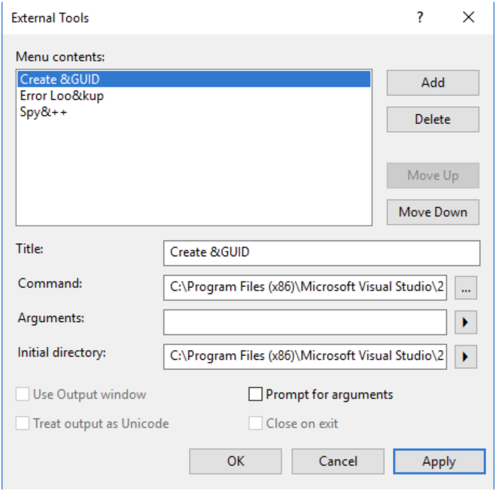
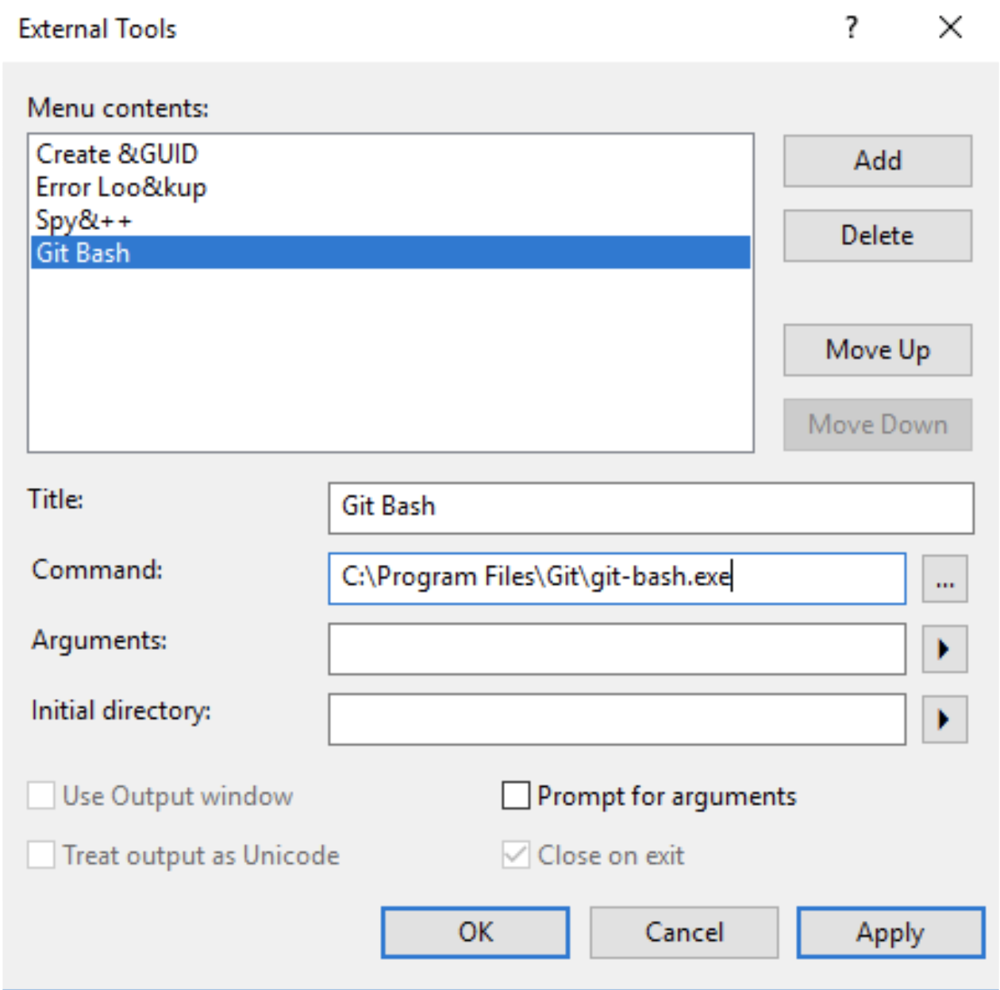

Visual Studio Code comes with integrated command prompts and its fairly easy to open multiple kinds of terminals out of the box. However, Visual Studio 2017 does not have integrated command prompt terminals but we can still open different terminals/apps from within VS by following below steps

1. Go to Tools menu option and click on “External Tools”
   

1) Click on “Add” and provide the path to `git-bash.exe` according to your installation directory. Provide a Title and click Ok.
   

After that, Git Bash will be added to the Tools menu and is just a click away. Cheers!
