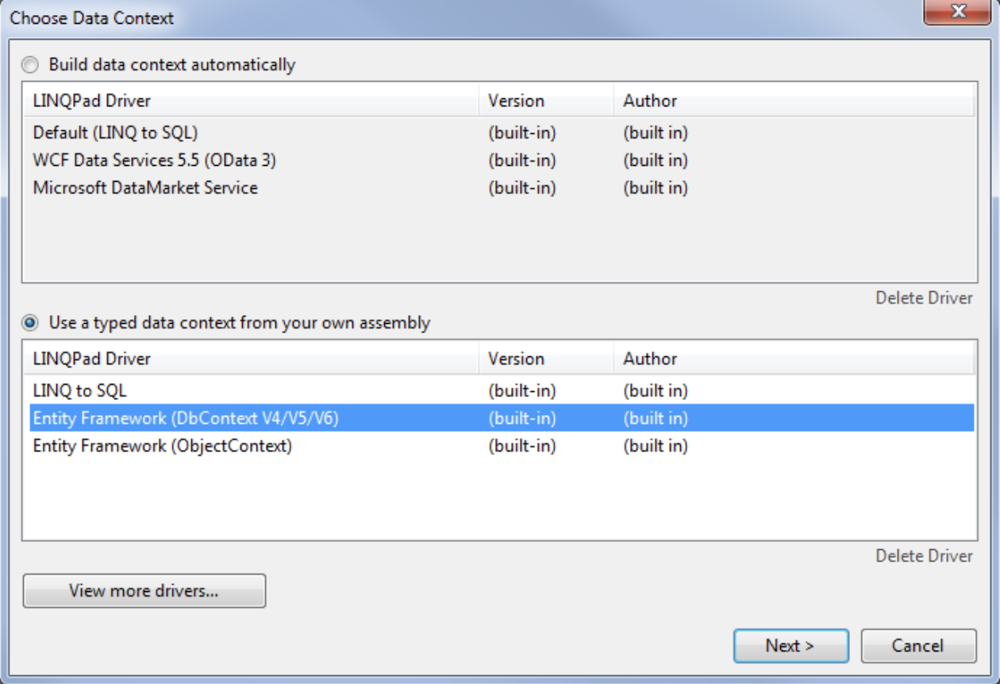

Anyone who has ever worked with .Net framework or .Net Core must have come across this awesome tool called [LINQPad](https://www.linqpad.net/). For those who don’t know, LINQPad is the .Net Programmer’s Playground. Basically it offers below features:

- Instantly test any `C#`, `F#` and `VB` snippet or program
- Query databases in LINQ (or SQL) — SQL/CE/Azure, Oracle, SQLite & MySQL
- Enjoy rich output formatting, optional autocompletion and integrated debugging
- Script and automate in your favorite .NET language

Last weekend, I was writing an Entity Framework method that ran a really long query on SQL Server. But I wanted to know exactly the SQL query that is being produced and run by EF LINQ to Entities on SQL Server. One option was that to run my application and open SQL Server Profiler and trace out the query but of course that means building your solution, running it and then tracing the query. If you have to update the query then you will need to repeat the process all over. Wouldn’t it be awesome to test generated queries using some tool? There comes LINQPad’s SQL server query feature.

LINQPad 5 can run queries on different databases by using, what they call as Drivers, that are different for each provider. For example, Entity Framework has different driver, SQLite, MySQL and Oracle has different drivers and so on. In my case I had to test EF queries whose driver comes pre-installed as shown below. Lets see how to do it

Create SQL Server Connection by opening explorer on the left and clicking “Add connection” and select your driver. I went for Entity Framework `DbContext` API as that’s what I’m using.



Specify path to DLL where your DBContext lives. Also select full type name of DbContext and provide file path for config file that contains the connection string.

Check your connection by clicking the Test button and then press Ok. You’ll see all entities pop under your connection and from there on you can query them as you do in .Net program.

Assuming you have a table named `Clothes` in your database, whose `DbContext` name is `StoreEntities`, then you will create and write queries something like below:

```csharp
var context = new StoreEntities();

var query = context.Clothes.AsNoTracking().Include(c => c.CreatedByUser).Where(c=>c.ObjectTypeCode == 1).ToList();
```

Above query, will produce something like below SQL

```sql
-- Region Parameters
DECLARE @p__linq__0 BigInt = 1
-- EndRegion

SELECT
[Extent1].[Id] AS [Id],
[Extent1].[ObjectTypeCode] AS [ObjectTypeCode],
[Extent1].[ObjectId] AS [ObjectId],
[Extent1].[UserId] AS [UserId],
[Extent1].[Title] AS [Title],
[Extent1].[Detail] AS [Detail],
[Extent1].[DeletedOn] AS [DeletedOn1]
FROM [dbo].[Clothes] AS [Extent1]
INNER JOIN [dbo].[Users] AS [Extent2] ON [Extent1].[UserId] = [Extent2].[Id]
WHERE ([Extent1].[ObjectId] = @p__linq__0)
```

It is super powerful to view generated SQL queries as you write code for your LINQ to Entities queries using Entity Framework. This way you can optimize your EF queries during development cycle and not when you think your program is running slow possibly due to a bad EF query.
